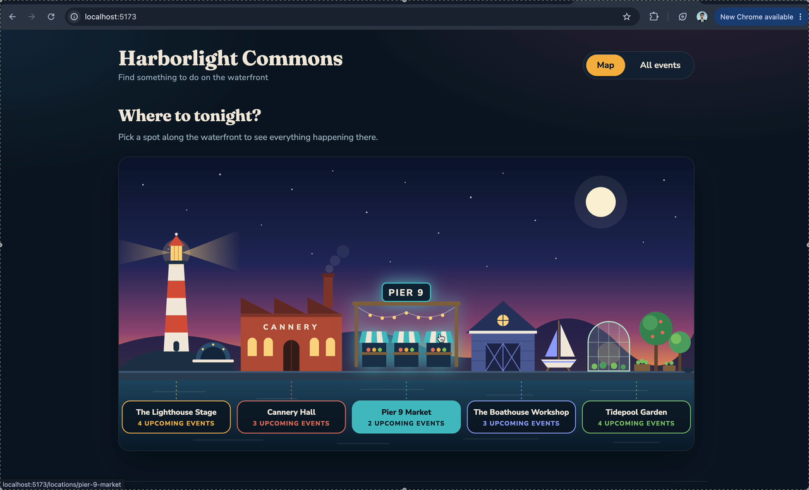

# WEB103 Project 3 - *Harborlight Commons*

Submitted by: **Arbaz Attar**

About this web app: **Harborlight Commons is a virtual community space for an imagined waterfront town. The front page is an illustrated map of the harbor; click the lighthouse, the cannery, the pier, the boathouse or the garden to open that location's page and see every event held there, each with a live countdown. A separate Events page lists everything in town and can be filtered by location. Built with a React frontend and a Node/Express API that reads locations and events from a Render PostgreSQL database.**

Time spent: **X** hours

## Required Features

The following **required** functionality is completed:

- [x] **The web app uses React to display data from the API**
- [x] **The web app is connected to a PostgreSQL database, with an appropriately structured Events table**
  - [ ]  **NOTE: Your walkthrough added to the README must include a view of your Render dashboard demonstrating that your Postgres database is available**
  - [x]  **NOTE: Your walkthrough added to the README must include a demonstration of your table contents. Use the psql command 'SELECT * FROM tablename;' to display your table contents.**
- [x] **The web app displays a title.**
- [x] **Website includes a visual interface that allows users to select a location they would like to view.**
  - [x] *Note: A non-visual list of links to different locations is insufficient.* 
- [x] **Each location has a detail page with its own unique URL.**
- [x] **Clicking on a location navigates to its corresponding detail page and displays list of all events from the `events` table associated with that location.**

The following **optional** features are implemented:

- [x] An additional page shows all possible events
  - [x] Users can sort *or* filter events by location.
- [x] Events display a countdown showing the time remaining before that event
  - [x] Events appear with different formatting when the event has passed (ex. negative time, indication the event has passed, crossed out, etc.).

The following **additional** features are implemented:

- [x] The map is drawn in inline SVG and built from the `locations` table: the name, the number of upcoming events and the link on each building all come from the API
- [x] The location filter on the Events page lives in the URL (`/events?location=cannery-hall`), so a filtered list can be bookmarked or shared
- [x] Every event list is split into "Coming up" (soonest first) and "Already happened" (most recent first)
- [x] Event times are stored as `TIMESTAMPTZ` and always shown in the venue's time zone, whatever time zone the visitor is in
- [x] The API answers with a JSON 404 for a location or event that does not exist, and the site shows a not-found page for any unknown URL
- [x] `npm run reset` drops, recreates and reseeds both tables in one command

## Video Walkthrough

Here's a walkthrough of implemented required features:

[](walkthrough.mp4)

Click the image or open [walkthrough.mp4](walkthrough.mp4) to play the walkthrough.

Video recorded with the macOS screen recorder and compressed with ffmpeg

## Notes

**Setting up the database**

1. On [Render](https://dashboard.render.com), choose **New → Postgres**, give it a name, pick the free instance and wait until its status reads **Available**.
2. Open the database's **Connections** panel and copy the username, password, external hostname, port and database name into `server/.env` (see `server/.env.example` for the variable names). `server/.env` is git-ignored.
3. Create and seed the tables, then start the app:

```bash
npm install
npm run reset
npm run dev
```

The site runs on http://localhost:5173 and the API on http://localhost:3000.

**The tables**

```sql
CREATE TABLE locations (
  id SERIAL PRIMARY KEY,
  slug VARCHAR(100) UNIQUE NOT NULL,
  name VARCHAR(255) NOT NULL,
  tagline VARCHAR(255) NOT NULL,
  description TEXT NOT NULL,
  address VARCHAR(255) NOT NULL,
  city VARCHAR(100) NOT NULL,
  state VARCHAR(2) NOT NULL,
  zip VARCHAR(10) NOT NULL
);

CREATE TABLE events (
  id SERIAL PRIMARY KEY,
  title VARCHAR(255) NOT NULL,
  description TEXT NOT NULL,
  category VARCHAR(50) NOT NULL,
  host VARCHAR(100) NOT NULL,
  price VARCHAR(20) NOT NULL,
  starts_at TIMESTAMPTZ NOT NULL,
  location_id INTEGER NOT NULL REFERENCES locations(id) ON DELETE CASCADE
);
```

**The API**

| Route | What it returns |
| --- | --- |
| `GET /api/locations` | every location, with its total and upcoming event counts |
| `GET /api/locations/:slug` | one location, or a JSON 404 |
| `GET /api/locations/:slug/events` | every event at that location, soonest first |
| `GET /api/events` | every event with its location's name and slug |
| `GET /api/events/:eventId` | one event, or a JSON 404 |

**Things that took some working out**

- **Links inside an SVG.** Each building on the map is a React Router `Link` wrapped around an SVG group, so a click changes the page without a reload and every building is still reachable with the Tab key. A transparent rectangle behind each building makes the whole column clickable, not just the painted pixels.
- **Time zones.** The seed file holds plain local times (`2026-10-09 19:30`) and the insert converts them with `AT TIME ZONE 'America/Los_Angeles'`, so the daylight-saving change in November is handled by Postgres. The frontend formats with the same zone, and the countdown is plain millisecond arithmetic on the stored instant.
- **One clock per page.** A small `useNow` hook ticks once a second at the page level and every event card works out its own countdown from it. When an event's start time goes by, the card moves from "Coming up" to "Already happened" on its own.
- **Style order with Pico.** The stylesheet imports in `main.jsx` have to come before the `App` import, otherwise Pico loads last and overrides the page styles.
- **SSL on Render, no SSL locally.** `server/config/database.js` turns SSL on unless `PGHOST` is `localhost`, so the same code works against Render and against a database on your own machine.

## License

Copyright 2026 Arbaz Attar

Licensed under the Apache License, Version 2.0 (the "License"); you may not use this file except in compliance with the License. You may obtain a copy of the License at

> http://www.apache.org/licenses/LICENSE-2.0

Unless required by applicable law or agreed to in writing, software distributed under the License is distributed on an "AS IS" BASIS, WITHOUT WARRANTIES OR CONDITIONS OF ANY KIND, either express or implied. See the License for the specific language governing permissions and limitations under the License.
